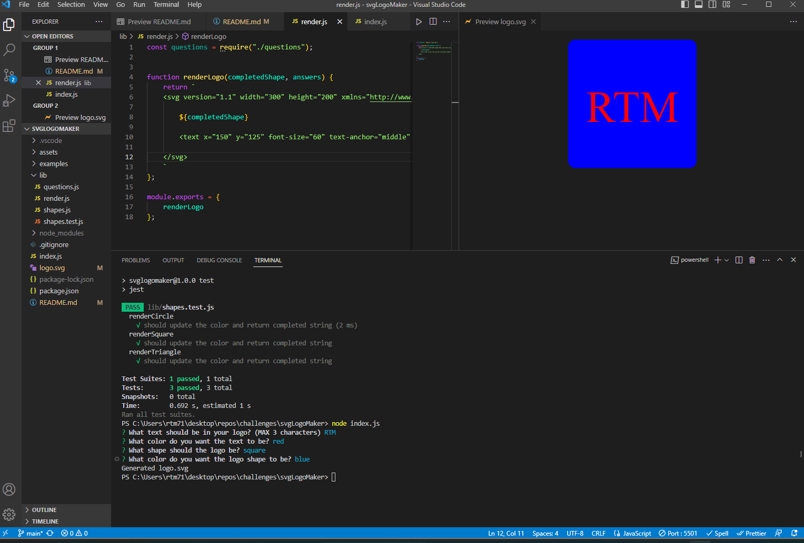

# svgLogoMaker

## Description
A simple logo generator that uses inquirer to prompt the user for input and then automatically generates a SVG logo that meets the users criteria. 

Run program with 'node index.js'

## User Story

```
AS a freelance web developer
I WANT to generate a simple logo for my projects
SO THAT I don't have to pay a graphic designer
```

## Acceptance Criteria

```
GIVEN a command-line application that accepts user input
WHEN I am prompted for text
THEN I can enter up to three characters
WHEN I am prompted for the text color
THEN I can enter a color keyword (OR a hexadecimal number)
WHEN I am prompted for a shape
THEN I am presented with a list of shapes to choose from: circle, triangle, and square
WHEN I am prompted for the shape's color
THEN I can enter a color keyword (OR a hexadecimal number)
WHEN I have entered input for all the prompts
THEN an SVG file is created named `logo.svg`
AND the output text "Generated logo.svg" is printed in the command line
WHEN I open the `logo.svg` file in a browser
THEN I am shown a 300x200 pixel image that matches the criteria I entered
```

## Installation 

Run command 'npm i' to install necessary dependencies.

## Screenshot


## Video Walkthrough


[Untitled_ Jun 16, 2023 3_22 PM.webm](https://github.com/rtm713/svgLogoMaker/assets/127454251/850eadae-50b7-44a8-b49f-dbe6c303cb80)
